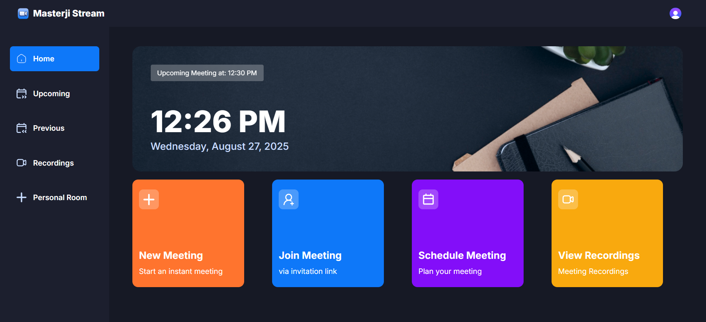
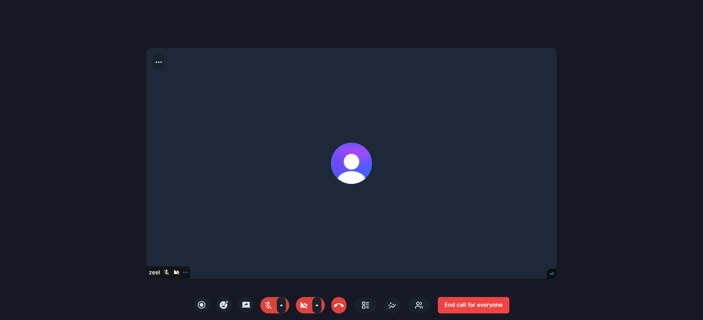

<div align="center">
  
  <h1>Masterji Stream</h1>
  <p>🚀 Integrated Video Conferencing Module for Masterji LMS</p>
  
  <div>
    
    
    
    
  </div>
  
  [](http://makeapullrequest.com)
</div>

## 📌 Table of Contents

- [✨ Features](#-features)
- [🚀 Quick Start](#-quick-start)
- [🔧 Configuration](#-configuration)
- [🏗️ Project Structure](#%EF%B8%8F-project-structure)
- [🛠️ Tech Stack](#%EF%B8%8F-tech-stack)
- [📱 Screenshots](#-screenshots)
- [🤝 Contributing](#-contributing)
- [📄 License](#-license)
- [🙏 Acknowledgments](#-acknowledgments)

## ✨ Features

### 🎯 Core Features
- 🔐 **Secure Authentication** with Clerk
- 🎥 **HD Video Conferencing** with real-time streaming
- 🎙️ **Crystal Clear Audio** with noise suppression
- 💬 **Real-time Chat** during meetings
- 📅 **Meeting Scheduling** with calendar integration
- 📱 **Fully Responsive** design for all devices

### 🌟 Premium Features
- 🎨 **Customizable UI** with SASS theming
- 🔄 **Screen Sharing** with annotation tools
- 📹 **Meeting Recording** with cloud storage
- 🤖 **AI-powered** meeting summaries
- 🔒 **End-to-end Encryption** for all communications

## 🚀 Quick Start

### Prerequisites
- Node.js 18+ (LTS recommended)
- npm 9+ or yarn 1.22+
- Clerk Account (for authentication)
- Stream Account (for video calling)

### Installation

1. **Clone the repository**
   ```bash
   git clone https://github.com/Masterji-LMS/masterji-stream.git
   cd masterji-stream
   ```

2. **Install dependencies**
   ```bash
   npm install
   # or
   yarn install
   ```

3. **Set up environment variables**
   Create a `.env.local` file in the root directory:
   ```env
   # Clerk Authentication
   NEXT_PUBLIC_CLERK_PUBLISHABLE_KEY=your_clerk_publishable_key
   CLERK_SECRET_KEY=your_clerk_secret_key
   
   # Stream Video
   NEXT_PUBLIC_STREAM_API_KEY=your_stream_api_key
   STREAM_SECRET_KEY=your_stream_secret_key
   
   # App Configuration
   NEXT_PUBLIC_APP_URL=http://localhost:3000
   ```

4. **Run the development server**
   ```bash
   npm run dev
   # or
   yarn dev
   ```

5. **Open in browser**
   Visit [http://localhost:3000](http://localhost:3000) to see your app running.

## 🔧 Configuration

### Environment Variables
| Variable | Description | Required |
|----------|-------------|----------|
| `NEXT_PUBLIC_CLERK_PUBLISHABLE_KEY` | Clerk publishable key | ✅ |
| `CLERK_SECRET_KEY` | Clerk secret key | ✅ |
| `NEXT_PUBLIC_STREAM_API_KEY` | Stream Video API key | ✅ |
| `STREAM_SECRET_KEY` | Stream Video secret key | ✅ |
| `NEXT_PUBLIC_APP_URL` | Your application URL | ❌ |

## 🏗️ Project Structure

```
masterji-stream/
├── app/                    # App router and pages
│   ├── (auth)/            # Authentication routes
│   ├── (root)/            # Protected routes
│   ├── api/               # API routes
│   └── globals.css        # Global styles
├── components/            # Reusable UI components
│   ├── ui/                # Shadcn/ui components
│   └── shared/            # Shared components
├── constants/             # Application constants
├── hooks/                 # Custom React hooks
├── lib/                   # Utility functions
├── public/                # Static assets
│   └── icons/             # SVG icons
├── styles/                # SASS styles and mixins
│   ├── _variables.scss    # SASS variables
│   ├── _mixins.scss      # SASS mixins
│   └── main.scss         # Main SASS file
└── .env.local             # Environment variables
```

## 🛠️ Tech Stack

- **Frontend Framework**: [Next.js 14](https://nextjs.org/)
- **Language**: [TypeScript](https://www.typescriptlang.org/)
- **Styling**: [Sass](https://sass-lang.com/) with CSS Modules
- **Authentication**: [Clerk](https://clerk.dev/)
- **Video Calling**: [Stream Video](https://getstream.io/video/)
- **UI Components**: [shadcn/ui](https://ui.shadcn.com/)
- **State Management**: React Context API
- **Form Handling**: React Hook Form
- **Icons**: [Lucide Icons](https://lucide.dev/)

## 📱 Screenshots

<!-- Add your screenshots here -->
<div align="center">
  
  
</div>

## 🤝 Contributing

This project is part of the Masterji LMS ecosystem. If you're interested in contributing, please contact the project maintainers.


